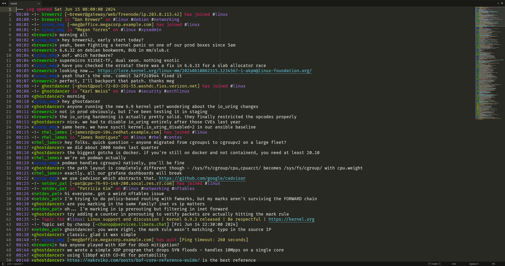

# sublime-irc

IRC log file syntax highlighting for Sublime Text.

## Supported Formats

- **irssi** — `-!-` event markers, unbracketed timestamps
- **weechat** — `-->`, `<--`, `--` event markers, tab-separated fields
- **HexChat** — `*` event markers, named-month timestamps (`Mar 27 12:34:56`)
- **mIRC** — `*` event markers, bracketed timestamps (`[12:34]`)
- **ZNC** — `***` event markers, `Joins:`/`Parts:`/`Quits:` keywords

IRC log files are auto-detected when possible via content matching.

## Preview

`irssi` formatted logs with Sublime Text's default `Monokai` color scheme:



## Installation

### With Package Control

1. [Install Package Control](https://packagecontrol.io/installation)
2. Install [IRC Syntax package](https://packagecontrol.io/packages/IRC%20Syntax)

    | Platform      | Install Command                                                |
    | --------------| -------------------------------------------------------------- |
    | macOS         | <kbd>Cmd</kbd> + <kbd>Shift</kbd> + <kbd>P</kbd> → Package Control: Install Package → IRC Syntax  |
    | Linux/Windows | <kbd>Ctrl</kbd> + <kbd>Shift</kbd> + <kbd>P</kbd> → Package Control: Install Package → IRC Syntax |

3. IRC log files are auto-detected. If not, select 'IRC' from `View → Syntax`.

### Without Package Control

1. Locate your Sublime Text "Packages" directory and navigate to it

    | Platform | Installation Path                                            |
    | -------- | ------------------------------------------------------------ |
    | Linux    | `~/.config/sublime-text/Packages/`                           |
    | macOS    | `~/Library/Application\ Support/Sublime\ Text/Packages/`     |
    | Windows  | `%AppData%\Roaming\Sublime Text\Packages`                    |

2. Clone this repository into `IRC Syntax` directory

    ```bash
    git clone https://github.com/barnumbirr/sublime-irc.git 'IRC Syntax'
    ```

## Configuration

### Uniquely colored nicknames

Navigate to `Preferences → Customize Color Scheme` and add the following to your
theme rules:

```json
    {
        "name": "IRC Nickname",
        "scope": "entity.name.tag.nickname.irc",
        "foreground": ["#FF0000", "#00FF00", "#0000FF"]
    }
```

These foreground colors should be readable in most themes.

## License:

```
Copyright 2021-2026 Martin Simon

Licensed under the Apache License, Version 2.0 (the "License");
you may not use this file except in compliance with the License.
You may obtain a copy of the License at

   http://www.apache.org/licenses/LICENSE-2.0

Unless required by applicable law or agreed to in writing, software
distributed under the License is distributed on an "AS IS" BASIS,
WITHOUT WARRANTIES OR CONDITIONS OF ANY KIND, either express or implied.
See the License for the specific language governing permissions and
limitations under the License.
```

## Buy me a coffee?

If you feel like buying me a coffee (or a beer?), donations are welcome:

```
BTC : bc1qq04jnuqqavpccfptmddqjkg7cuspy3new4sxq9
DOGE: DRBkryyau5CMxpBzVmrBAjK6dVdMZSBsuS
ETH : 0x2238A11856428b72E80D70Be8666729497059d95
LTC : MQwXsBrArLRHQzwQZAjJPNrxGS1uNDDKX6
```
